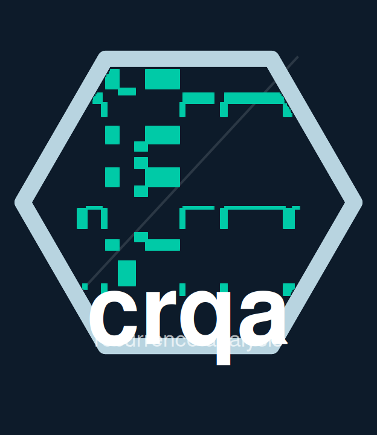

# crqa 

**Unidimensional and Multidimensional Methods for Recurrence Quantification Analysis**

The crqa R package allows users to conduct a wide range of recurrence-based analyses on single (e.g., auto-recurrence) and multivariate time series (e.g., multidimensional cross-recurrence quantification), examine coupling properties underlying leader-follower relationships (i.e., diagonal-profile methods), as well as track the evolution of recurrence rate over the time course (i.e., windowed methods).

## Installation

``` r
# You can install the latest version of crqa on CRAN by running:
install.packages("crqa")

# Or for the development version from GitHub:
# install.packages("devtools")
devtools::install_github("morenococo/crqa")
```

## What's new in v2.1.0

- **5–15× faster, lower memory.** A fused C++ (Rcpp) kernel replaces the old R pipeline for the three most common distance metrics (Euclidean, maximum, Manhattan). It runs a single pass over the phase-space matrix and never allocates the full N×N distance or recurrence matrix — memory scales as O(N + nnz) instead of O(N²). The practical limit grew from ~10 000 to ≥ 20 000 data points within a 30-second budget on a laptop.

- **OpenMP parallelism.** The fused kernel runs in parallel across CPU cores out of the box. Sparse recurrence regimes (the typical CRQA case) scale near-linearly with the number of cores. Thread count is controlled via the standard `OMP_NUM_THREADS` environment variable.

- **Approximative RQA for very long series.** `method = "aRQA"` in `crqa()` dispatches to a phase-space histogram algorithm (Schultz et al. 2015) that computes RR, DET and L in O(N) memory. Designed for N ≥ 10 000 where exact computation is expensive.

- **Theiler-aware recurrence rate.** All functions now accept `rr_denom = "valid"` (default `"full"` for backward compatibility), which excludes Theiler-blanked and side-masked cells from the RR denominator — making RR internally consistent with DET and ENTR.

- **Global normalisation fix.** `wincrqa()`, `windowdrp()` and `piecewiseRQA()` now apply `normalize` once to the full series before windowing, so all windows share the same scale reference. Previously normalisation was applied independently per window, shifting the effective threshold across windows.

- **New functions.** `aRQA()`, `line_stats()`, `theiler_exclusion()`, `rosslerattractor()`.

# Usage

crqa comes with bundled datasets that can be used to explore the different functions.

``` r
data(crqa) # loads eyemovement, handmovement, and text datasets
```

## Auto-recurrence on a categorical time-series

Run auto-recurrence on a nursery rhyme (“The wheels on the bus”, 120 words):

``` r
delay = 1; embed = 1; rescale = 0; radius = 0.0001
normalize = 0; mindiagline = 2; minvertline = 2
tw = 1; whiteline = FALSE; recpt = FALSE
side = “both”; method = “rqa”; metric = “euclidean”
datatype = “categorical”

ans = crqa(ts1 = text, ts2 = text,
           delay = delay, embed = embed, rescale = rescale,
           radius = radius, normalize = normalize,
           mindiagline = mindiagline, minvertline = minvertline,
           tw = tw, whiteline = whiteline, recpt = recpt,
           side = side, method = method, metric = metric,
           datatype = datatype)

print(ans[!names(ans) %in% “RP”])
```

## Cross-recurrence on a categorical time-series

Eye-tracking data from a joint task: 2,000 observations of six screen locations
looked at by a narrator and a listener.

``` r
narrator = eyemovement$narrator
listener  = eyemovement$listener

delay = 1; embed = 1; rescale = 0; radius = 0.001
normalize = 0; mindiagline = 2; minvertline = 2
tw = 0; whiteline = FALSE; recpt = FALSE; side = “both”
method = “crqa”; metric = “euclidean”; datatype = “categorical”

ans = crqa(ts1 = narrator, ts2 = listener,
           delay = delay, embed = embed, rescale = rescale,
           radius = radius, normalize = normalize,
           mindiagline = mindiagline, minvertline = minvertline,
           tw = tw, whiteline = whiteline, recpt = recpt,
           side = side, method = method, metric = metric,
           datatype = datatype)

print(ans[!names(ans) %in% “RP”])
```

### Diagonal cross-recurrence profile

Extract the diagonal cross-recurrence profile (DCRP) to quantify
leader–follower dynamics across a range of lags:

``` r
timecourse = round(seq(-3300, 3300, 33) / 1000, digits = 2)

res = drpfromts(ts1 = narrator, ts2 = listener,
                windowsize = 100,
                delay = 1, embed = 1, rescale = 0,
                radius = 0.001, normalize = 0,
                mindiagline = 2, minvertline = 2,
                tw = 0, whiteline = FALSE, recpt = FALSE,
                side = “both”, method = “crqa”,
                metric = “euclidean”, datatype = “categorical”)

profile = res$profile * 100  # recurrence rate in %

plot(timecourse, profile, type = “l”, lwd = 2.5,
     xlab = “Lag (seconds)”, ylab = “Recurrence Rate %”)
```

## Multidimensional cross-recurrence quantification analysis

Hand-movement data from a LEGO joint construction task (5,799 observations,
two position channels per person):

``` r
P1 = cbind(handmovement$P1_TT_d, handmovement$P1_TT_n)
P2 = cbind(handmovement$P2_TT_d, handmovement$P2_TT_n)

delay = 5; embed = 2; rescale = 0; radius = 0.1
normalize = 0; mindiagline = 10; minvertline = 10
tw = 0; whiteline = FALSE; recpt = FALSE; side = “both”
method = “mdcrqa”; metric = “euclidean”; datatype = “continuous”

ans = crqa(ts1 = P1, ts2 = P2,
           delay = delay, embed = embed, rescale = rescale,
           radius = radius, normalize = normalize,
           mindiagline = mindiagline, minvertline = minvertline,
           tw = tw, whiteline = whiteline, recpt = recpt,
           side = side, method = method, metric = metric,
           datatype = datatype)

print(ans[!names(ans) %in% “RP”])
```

## Authors

* **Moreno I. Coco** - *creator, author* - (moreno.cocoi@gmail.com)
* **Dan Mønster** - *author* - (danm@econ.au.dk)
* **Giuseppe Leonardi** - *author* - (g.leonardi@vizja.pl)
* **Rick Dale** - *author* - (rdale@ucla.edu)
* **Sebastian Wallot** - *author* - (sebastian.wallot@ae.mpg.de)

## Contributors

* **James D. Dixon** - (james.dixon@uconn.edu)
* **John C. Nash** - (nashjc@uottawa.ca)
* **Alexandra Paxton** - (alexandra.paxton@uconn.edu)
* **Polyphony Bruna** - (pbruna@ucmerced.edu)