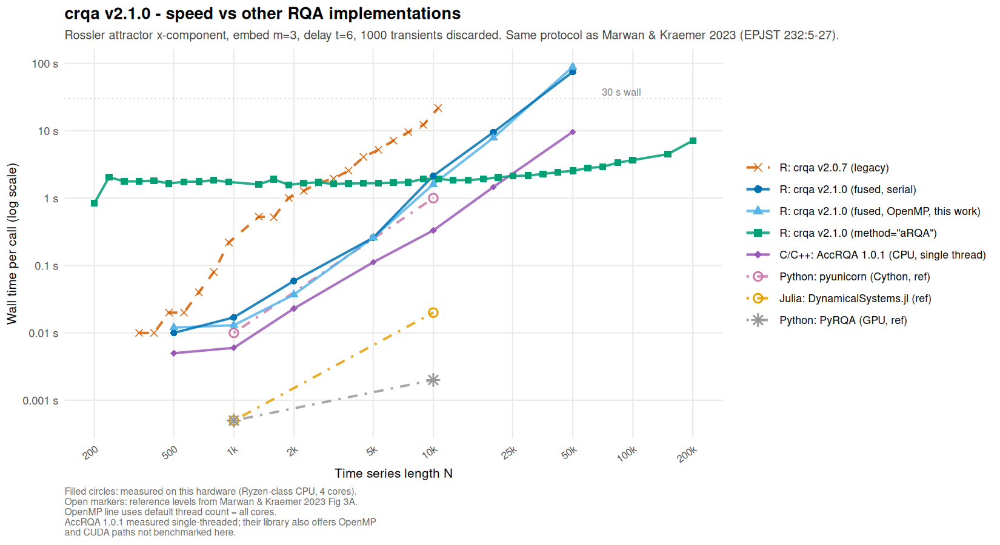

```{r setup, include = FALSE}
knitr::opts_chunk$set(
  collapse  = TRUE,
  comment   = "#>",
  eval      = TRUE
)
library(crqa)
```

## Overview

`crqa` (Coco & Dale 2014; Coco et al. 2021) is the primary R package for
**recurrence quantification analysis (RQA)** on behavioural, physiological,
and linguistic time series. It provides:

- Auto-recurrence (`method = "rqa"`), cross-recurrence (`"crqa"`), and
  multidimensional cross-recurrence (`"mdcrqa"`) with the full set of
  standard RQA measures.
- Diagonal recurrence profiles (`drpfromts`) for leader–follower analysis.
- Windowed and piecewise analyses (`wincrqa`, `windowdrp`, `piecewiseRQA`).
- Parameter optimisation (`optimizeParam`).
- Visualisation (`plot_rp`).

### Performance in context (v2.1.0)

Version 2.1.0 replaces the legacy `spdiags`-based pipeline with a fused
Rcpp inner loop that never materialises the N×N distance matrix, and
adds OpenMP parallelism on top. Figure 1 plots wall time vs. N on the
Rössler-system benchmark of Marwan & Kraemer (2023, *EPJST* 232:5–27)
— the standard reference for RQA package comparisons (m = 3, τ = 6,
Euclidean norm, dense ~2 % recurrence, 30 s cutoff per call).

```{r benchmark-fig, echo = FALSE, out.width = "100%", fig.cap = "Figure 1. Wall time per call for crqa v2.1.0 vs. other RQA implementations on the Rössler-system benchmark (Marwan & Kraemer 2023). Filled markers: measured on this hardware (4-core Ryzen-class CPU). Open markers: reference levels from Marwan & Kraemer 2023 Fig 3A. AccRQA 1.0.1 measured single-threaded — their library also offers OpenMP and CUDA paths not benchmarked here. The crqa serial line uses OMP_NUM_THREADS=1; the OpenMP line uses all 4 cores. The aRQA path is a fundamentally different algorithm (phase-space histogram) with O(N) memory and scales to N = 200 000 in seconds."}

```

The figure summarises crqa's competitive position:

- **`crqa v2.0.7 (legacy)`** hits the 30 s wall and OOMs at N ≈ 12 k.
- **`crqa v2.1.0 (fused, serial)`** is 5–15× faster than v2.0.7 and
  comparable to pyunicorn (Cython, Python) on CPU.
- **`crqa v2.1.0 (fused, OpenMP)`** further accelerates the kernel by
  parallelising the distance-and-threshold loop. At moderate N the gain
  is ~1.3–1.9× on 4 cores. The dense-RR regime shown here is the worst
  case for OpenMP scaling (the post-loop diagonal-line sort is
  sequential and dominates at high N); typical sparser analyses
  (RR ≲ 0.5 %) approach near-linear scaling with cores.
- **`crqa v2.1.0 (method = "aRQA")`** is part of this package and
  scales to N = 200 000 in seconds with O(N) memory — a regime where
  all exact O(N²) methods run out of memory.
- **AccRQA 1.0.1 (CPU)** is faster than crqa fused on this auto-RQA
  benchmark by ~3–6× single-threaded; with its OpenMP and CUDA paths
  it widens further. AccRQA does not implement cross-recurrence
  (CRQA), multidimensional (mdcrqa), windowed analysis, categorical
  data, Theiler windows, optimisation, or visualisation — those are
  exclusive to crqa.

The two libraries are complementary: AccRQA is a GPU-aware kernel
library for vanilla auto-RQA on long single time series; crqa is the
R-native analytical toolbox for the broader range of recurrence
analyses used in behavioural, cognitive and linguistic research.

By default crqa uses **all available cores via OpenMP**. To force
serial execution set `OMP_NUM_THREADS=1` in the shell *before*
launching R (setting it via `Sys.setenv()` from inside R is too late —
libgomp caches the thread count at first use). To cap parallelism,
set `OMP_NUM_THREADS=N` similarly. When using a wrapper's `workers`
argument, set `OMP_NUM_THREADS=1` in the parent session to avoid CPU
over-subscription.

---

## Installation

```{r install, eval = FALSE}
install.packages("crqa")          # CRAN release
# devtools::install_github("morenococo/crqa")  # development version
```

---

## Core concepts and the `crqa()` function

All analyses go through `crqa()` or one of its wrappers. The key arguments:

| Argument | Role | Default |
|---|---|---|
| `ts1`, `ts2` | Time series (vectors or matrices) | — |
| `delay` | Embedding delay τ | 1 |
| `embed` | Embedding dimension m | 1 |
| `radius` | Recurrence threshold ε | 0.001 |
| `rescale` | Rescale distance matrix (0–4) | 0 |
| `normalize` | Normalize series (0 = none, 1 = unit, 2 = z) | 0 |
| `tw` | Theiler window | 0 |
| `mindiagline` | Min diagonal-line length | 2 |
| `minvertline` | Min vertical-line length | 2 |
| `side` | `"both"`, `"upper"`, or `"lower"` | `"both"` |
| `method` | `"rqa"`, `"crqa"`, `"mdcrqa"`, `"aRQA"` | `"rqa"` |
| `whiteline` | Compute white-line statistics? | `FALSE` |
| `rr_denom` | RR denominator: `"valid"` or `"full"` (v2.0.7 compat.) | `"valid"` |
| `workers` | Parallel workers (wrappers only) | 1 |

### Return value

`crqa()` returns a named list:

- `RR` — recurrence rate (%)
- `DET` — determinism (%)
- `NRLINE` — number of diagonal lines ≥ `mindiagline`
- `maxL` — longest diagonal line
- `L` — mean diagonal-line length
- `ENTR` — entropy of the diagonal-line length distribution
- `rENTR` — normalised entropy
- `LAM` — laminarity (%)
- `TT` — trapping time (mean vertical-line length)
- `max_vertlength` — longest vertical line
- `wmean`, `wmax`, `wENTR` — white-line stats (if `whiteline = TRUE`)
- `RP` — the recurrence plot as a sparse matrix (`Matrix` class)

---

## Example 1 — Auto-recurrence on categorical data

A nursery rhyme ("The Wheels on the Bus") encoded as a word vector.
With categorical data set `radius` small so only identical tokens recur.

```{r rqa-cat}
data(crqa)

ans_rqa <- crqa(text, text,
                delay = 1, embed = 1, rescale = 0, radius = 0.0001,
                normalize = 0, mindiagline = 2, minvertline = 2,
                tw = 1, whiteline = FALSE, recpt = FALSE,
                side = "both", method = "rqa",
                metric = "euclidean", datatype = "categorical")

# Print all scalar measures (exclude the RP itself)
print(ans_rqa[!names(ans_rqa) %in% "RP"])
```

### Visualising the recurrence plot

```{r rqa-plot, fig.width = 5, fig.height = 5, out.width = "60%"}
plot_rp(ans_rqa$RP,
        title = "Auto-RP: Wheels on the Bus",
        xlabel = "Word index", ylabel = "Word index")
```

---

## Example 2 — Cross-recurrence on categorical data

Eye-tracking data: narrator and listener looking at six screen locations
during a joint description task. Cross-recurrence quantifies how temporally
coupled their gaze patterns are.

```{r crqa-cat}
listener <- eyemovement$listener[1:500]
narrator <- eyemovement$narrator[1:500]

ans_crqa <- crqa(narrator, listener,
                 delay = 1, embed = 1, rescale = 0, radius = 0.01,
                 normalize = 0, mindiagline = 2, minvertline = 2,
                 tw = 0, whiteline = FALSE, recpt = FALSE,
                 side = "both", method = "crqa",
                 metric = "euclidean", datatype = "categorical")

cat(sprintf("RR = %.2f%%   DET = %.2f%%   LAM = %.2f%%\n",
            ans_crqa$RR, ans_crqa$DET, ans_crqa$LAM))
```

### White-line statistics (new in v2.1.0)

White vertical lines are gaps between recurrent stretches in the same
column. Their distribution approximates the inter-recurrence time
distribution; `wENTR` is the recurrence-time entropy (Faure & Korn 2004).
Enabling `whiteline = TRUE` costs essentially nothing — the scan runs in
the same sparse-index pass as the black-line statistics.

```{r whiteline}
ans_wl <- crqa(narrator, narrator,
               delay = 1, embed = 1, rescale = 0, radius = 0.001,
               normalize = 0, mindiagline = 2, minvertline = 2,
               tw = 0, whiteline = TRUE, recpt = FALSE,
               side = "both", method = "rqa",
               metric = "euclidean", datatype = "categorical")

cat(sprintf("wmean = %.2f   wmax = %d   wENTR = %.3f\n",
            ans_wl$wmean, ans_wl$wmax, ans_wl$wENTR))
```

---

## Example 3 — Multidimensional cross-recurrence (mdCRQA)

Hand-movement data from a joint LEGO construction task: two participants'
wrist positions in two spatial dimensions.

```{r mdcrqa}
handset <- handmovement[1:300, ]

P1 <- cbind(handset$P1_TT_d, handset$P1_TT_n)
P2 <- cbind(handset$P2_TT_d, handset$P2_TT_n)

ans_md <- crqa(P1, P2,
               delay = 5, embed = 2, rescale = 0, radius = 0.3,
               normalize = 0, mindiagline = 2, minvertline = 2,
               tw = 0, whiteline = FALSE, recpt = FALSE,
               side = "both", method = "mdcrqa",
               metric = "euclidean", datatype = "continuous")

cat(sprintf("RR = %.2f%%   DET = %.2f%%   LAM = %.2f%%\n",
            ans_md$RR, ans_md$DET, ans_md$LAM))
```

---

## Example 4 — Diagonal recurrence profile (leader–follower)

`drpfromts()` extracts the diagonal cross-recurrence profile: for each
lag δ, it reports the mean recurrence along the diagonal at that offset.
The peak lag identifies the temporal lead of one series over the other.

```{r drp, fig.width = 6, fig.height = 4, out.width = "75%"}
res <- drpfromts(narrator, listener,
                 windowsize = 100,
                 radius = 0.001, delay = 1, embed = 1,
                 rescale = 0, normalize = 0,
                 mindiagline = 2, minvertline = 2,
                 tw = 0, whiteline = FALSE, recpt = FALSE,
                 side = "both", method = "crqa",
                 metric = "euclidean", datatype = "categorical")

timecourse <- seq_along(res$profile) - ceiling(length(res$profile) / 2)
plot(timecourse, res$profile * 100,
     type = "l", lwd = 2,
     xlab = "Lag (samples)", ylab = "Recurrence rate (%)",
     main = "Diagonal cross-recurrence profile")
abline(v = res$maxlag - ceiling(length(res$profile) / 2),
       col = "red", lty = 2)
```

---

## Example 5 — Windowed RQA (time-varying dynamics)

`wincrqa()` slides a window over the time series and returns one row of
RQA measures per window — useful for tracking how coupling evolves.

```{r wincrqa, fig.width = 6, fig.height = 4, out.width = "75%"}
win_res <- wincrqa(narrator, listener,
                   windowstep = 20, windowsize = 80,
                   delay = 1, embed = 1,
                   radius = 0.001, rescale = 0, normalize = 0,
                   mindiagline = 2, minvertline = 2,
                   tw = 0, whiteline = FALSE, recpt = FALSE,
                   side = "both", method = "crqa",
                   metric = "euclidean", datatype = "categorical",
                   trend = FALSE, workers = 1L)

plot(win_res$win, win_res$RR,
     type = "l", lwd = 2,
     xlab = "Window", ylab = "RR (%)",
     main = "Windowed RR (narrator-listener gaze coupling)")
```

Parallel execution is available via `workers > 1` using the `future`
backend. Worker spawn overhead dominates for short jobs; use `workers > 1`
when individual windows take > 0.5 s each.

```{r wincrqa-parallel, eval = FALSE}
# Cap each crqa() call to one OpenMP thread so the per-window cost
# stays predictable; the parallelism comes from `workers`, not from
# OpenMP. This avoids the M-workers x T-OpenMP-threads oversubscription.
# IMPORTANT: set OMP_NUM_THREADS in the shell BEFORE launching R —
# Sys.setenv() from inside R is too late because libgomp caches the
# thread count at first parallel region.
#
#   $ OMP_NUM_THREADS=1 R   # then run this:
win_par <- wincrqa(narrator, listener,
                   windowstep = 20, windowsize = 80,
                   delay = 1, embed = 1, radius = 0.001,
                   workers = 4L)   # uses 4 CPU cores
```

---

## Example 6 — Approximative RQA for very long series (new in v2.1.0)

For N > ~10 000, the exact methods run out of memory (O(N²) peak RAM).
`method = "aRQA"` implements the phase-space histogram approach of
Schultz, Spiegel, Marwan & Albayrak (2015, *Phys. Lett. A* 379:997)
and runs in O(N) memory. It is available directly via `crqa()`:

```{r arqa}
# Simulate 5000 points of AR(1) data as a stand-in for a long series
set.seed(42)
x <- as.numeric(arima.sim(model = list(ar = 0.7), n = 5000))

res_arqa <- crqa(x, x,
                 delay = 1, embed = 3, radius = 0.5,
                 normalize = 2, mindiagline = 2,
                 method = "aRQA")

cat(sprintf("aRQA:  RR = %.3f%%   DET = %.2f%%   L = %.2f\n",
            res_arqa$RR, res_arqa$DET, res_arqa$L))
```

**When to use aRQA:** for stochastic or weakly-deterministic data with
N > 10 000 where exact computation is infeasible. The approximation error
on DET is a few percentage points for stochastic data and larger for
strongly deterministic systems (see the help page `?aRQA` for details).
For comparison at moderate N:

```{r arqa-compare, eval = FALSE}
# Exact crqa for the same series at N = 1000 (comparable parameter set)
x_short <- x[1:1000]

res_exact <- crqa(x_short, x_short,
                  delay = 1, embed = 3, radius = 0.5,
                  normalize = 2, mindiagline = 2,
                  method = "rqa")

res_approx <- crqa(x_short, x_short,
                   delay = 1, embed = 3, radius = 0.5,
                   normalize = 2, mindiagline = 2,
                   method = "aRQA")

cat(sprintf("Exact:  RR = %.3f%%  DET = %.2f%%\n", res_exact$RR,  res_exact$DET))
cat(sprintf("aRQA:   RR = %.3f%%  DET = %.2f%%\n", res_approx$RR, res_approx$DET))
```

---

## Example 7 — Parameter optimisation

`optimizeParam()` uses average mutual information (AMI) for delay,
false nearest neighbours (FNN) for embedding dimension, and binary
search for the radius that yields a target recurrence rate.

```{r optim, eval = FALSE}
data(crqa)

handset <- handmovement[1:300, ]
P1 <- cbind(handset$P1_TT_d, handset$P1_TT_n)
P2 <- cbind(handset$P2_TT_d, handset$P2_TT_n)

par <- list(method = "mdcrqa", metric = "euclidean",
            maxlag = 20, radiusspan = 100, normalize = 0,
            rescale = 4, mindiagline = 10, minvertline = 10,
            tw = 0, whiteline = FALSE, recpt = FALSE,
            side = "both", datatype = "continuous",
            fnnpercent = NA, typeami = NA,
            nbins = 50, criterion = "firstBelow",
            threshold = 1, maxEmb = 20, numSamples = 500,
            Rtol = 10, Atol = 2)

results <- optimizeParam(P1, P2, par, min.rec = 2, max.rec = 5)
print(unlist(results))
```

---

## Note on the `rr_denom` argument (v2.1.0)

Version 2.1.0 introduces `rr_denom = c("valid", "full")`:

- `"valid"` (default): the denominator counts only cells that survived
  the Theiler window and side mask — the fraction of *analysable* pairs
  that are recurrent. Internally consistent with how DET and ENTR are
  computed.
- `"full"`: reproduces the historical convention (Marwan et al. 2007,
  *Phys. Rep.* 438:237) and the behaviour of crqa ≤ 2.0.7 — the
  denominator is always N×M regardless of blanking.

When `tw == 0` and `side == "both"` (the most common case) both
conventions give identical results.

```{r rr-denom}
narrator_full <- eyemovement$narrator
listener_full <- eyemovement$listener

r_valid <- crqa(narrator_full, listener_full,
                delay = 1, embed = 1, rescale = 0, radius = 0.001,
                normalize = 0, mindiagline = 2, minvertline = 2,
                tw = 2, side = "both", method = "crqa",
                metric = "euclidean", datatype = "categorical",
                rr_denom = "valid")

r_full <- crqa(narrator_full, listener_full,
               delay = 1, embed = 1, rescale = 0, radius = 0.001,
               normalize = 0, mindiagline = 2, minvertline = 2,
               tw = 2, side = "both", method = "crqa",
               metric = "euclidean", datatype = "categorical",
               rr_denom = "full")

cat(sprintf("rr_denom='valid': RR = %.4f%%\n", r_valid$RR))
cat(sprintf("rr_denom='full':  RR = %.4f%%  (v2.0.7 convention)\n", r_full$RR))
```

---

## References

Coco, M. I., & Dale, R. (2014). Cross-recurrence quantification analysis of
categorical and continuous time series: An R package. *Frontiers in
Psychology*, **5**, 510.

Coco, M. I., et al. (2021). crqa: Recurrence quantification analysis for
categorical and continuous time series in R. *The R Journal*, **13**, 83–97.

Faure, P., & Korn, H. (2004). A new method to estimate the Kolmogorov
entropy from recurrence plots. *Physics Letters A*, **332**, 329–339.

Marwan, N., Romano, M. C., Thiel, M., & Kurths, J. (2007). Recurrence plots
for the analysis of complex systems. *Physics Reports*, **438**, 237–329.

Marwan, N., & Kraemer, K. H. (2023). Trends in recurrence analysis of
dynamical systems. *European Physical Journal Special Topics*, **232**, 5–27.

Schultz, D., Spiegel, S., Marwan, N., & Albayrak, S. (2015). Approximation
of diagonal line based measures in recurrence quantification analysis.
*Physics Letters A*, **379**, 997–1011.

Wallot, S. (2018). Multidimensional cross-recurrence quantification analysis
(MdCRQA). *Multivariate Behavioral Research*, 1–19.
